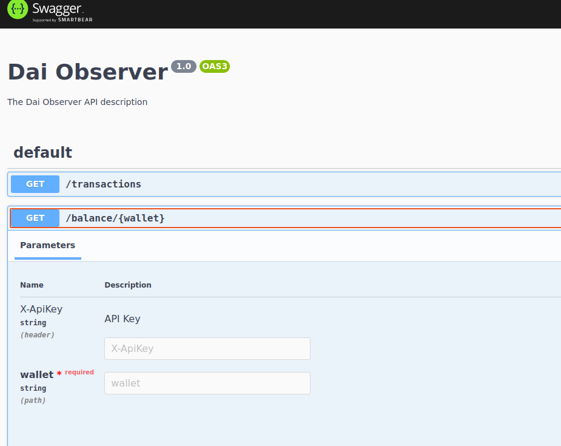

## DAI Wallet Observer

This codebase is a toy project to play around with blockchain data and in particular events produced by the DAI smart contract. It stores transactions block by block as requested in the project description, it doesn't make sure that enough
confirmations have been happened and it's not correcting previous transactions in case of orphaned blocks. **It is only released for didactic purposes**

The project is written in Nodejs(Typescript) and it uses [nest.js](https://nestjs.com/) as the main dependency and framework. It also uses [Web3js](https://web3js.readthedocs.io/en/v1.8.0/) to interface with the blockchain.

The project can be run with "npm run start" inside the __dai-listener__ folder.
Run tests with:

for unit tests
$ npm run test

for e2e tests
$ npm run test:e2e

A file named **.env** must be added with the address of the MongoDB database and the websocket connection for Alchemy/Infura node. I've tested it with my Alchemy account.

MONGO_ADDRESS="mongodb://localhost/daiobserver"
RPC_NODE_WEBSOCKET="INSERT_BLOCKCHAIN_NODE_RPC_WS"

The module inside the blockchain folder and in particular BlockchainService will connect to the blockchain and download block by block in search of transactions related to the DAO smart contract. 
As a simple optimization the service uses the __logs bloom filter__ to avoid downloading blocks that don't contain the smart contract address. I also manually parse the erc20 Transfer ABI to avoid using an external library that would make this toy project less interesting to study blockchain data.

There are 2 rest endpoints:
* Get transactions, lists the last 100 DAI transactions, if specified it filters them by sender or recipient,
  it uses cursor pagination using the mongodb id as parameter
* get balance/{address}, returns the balance of the wallet. 

Each request must contain x-apikey, failure to add this header will result in **401 unauthorized**. This can be disabled in the middleware layer

